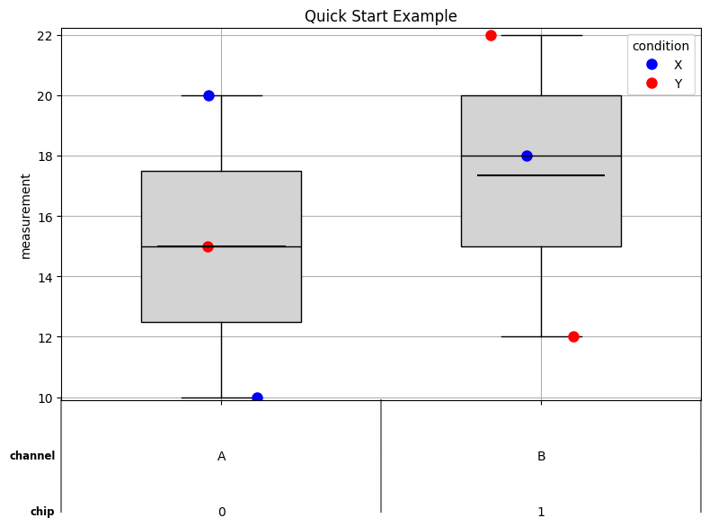
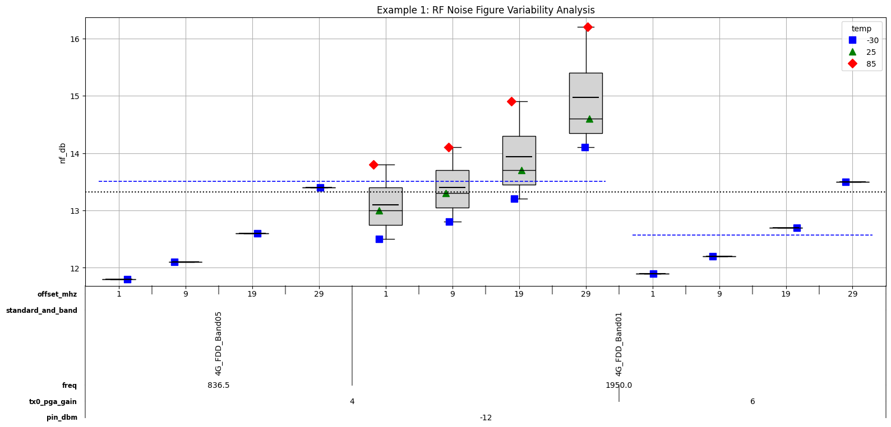
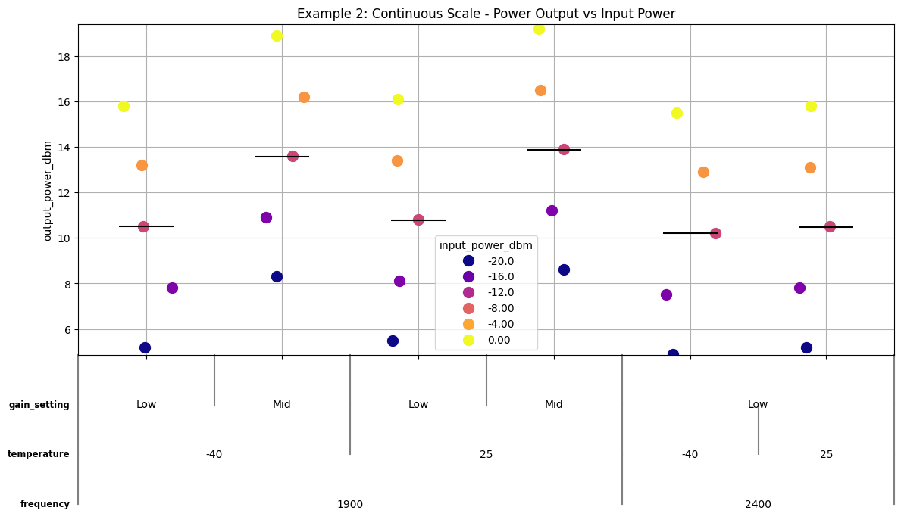
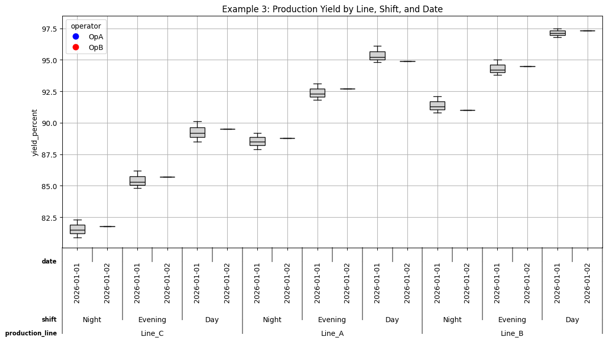

# PyVarChart

**A Python library for creating variability charts with hierarchical x-axis grouping**

[](https://www.python.org/downloads/)
[](LICENSE)
[](CHANGELOG.md)

PyVarChart enables sophisticated visualization of data variability across multiple categorical factors with support for custom ordering, color themes, marker styles, and statistical overlays. Perfect for exploring complex datasets with hierarchical grouping structures.

---

## Table of Contents

- [Features](#features)
- [Installation](#installation)
- [Quick Start](#quick-start)
- [Core Concepts](#core-concepts)
- [Complete Feature Guide](#complete-feature-guide)
  - [Hierarchical X-Axis Grouping](#hierarchical-x-axis-grouping)
  - [Legend and Color Themes](#legend-and-color-themes)
  - [Statistical Overlays](#statistical-overlays)
  - [Customization Options](#customization-options)
- [Advanced Examples](#advanced-examples)
- [API Reference](#api-reference)
- [Contributing](#contributing)
- [License](#license)

---

## Features

✨ **Core Capabilities:**
- **Hierarchical X-Axis Grouping** - Visualize data across multiple categorical levels
- **Flexible Color Themes** - Support for 100+ matplotlib colormaps plus custom gradients
- **Statistical Overlays** - Boxplots, cell means, group means, and grand mean
- **Continuous & Categorical Scales** - Automatic legend quantization for continuous data
- **Custom Ordering** - Full control over category sort order
- **Point Jittering** - Reveal overlapping data points
- **Customizable Markers** - Multiple marker themes and sizes
- **Label Rotation** - Vertical/horizontal labels with fine-tuned spacing

🎯 **Use Cases:**
- **RF/Hardware Testing** - Analyze measurements across chips, channels, frequencies, power levels
- **A/B Testing** - Compare metrics across experimental conditions
- **Quality Analysis** - Track variability across production batches, locations, time periods
- **Scientific Data** - Visualize results across treatment groups, timepoints, subjects

---

## Installation

### From Source
```bash
git clone https://github.com/Guy-Steiff/pyvarchart.git
cd pyvarchart
pip install -e .
```

### Requirements
```
python >= 3.7
pandas >= 1.0.0
numpy >= 1.18.0
matplotlib >= 3.2.0
```

---

## Quick Start

```python
import pandas as pd
from pyvarchart import PyVarChart

# Load your data
df = pd.DataFrame({
    'measurement': [10, 15, 20, 12, 18, 22],
    'chip': [0, 0, 0, 1, 1, 1],
    'channel': ['A', 'A', 'A', 'B', 'B', 'B'],
    'condition': ['X', 'Y', 'X', 'Y', 'X', 'Y']
})

# Create chart
pvc = PyVarChart(
    str_yaxis_var_name='measurement',
    lst_xaxis_var_names=['chip', 'channel'],
    str_legend='condition',
    int_show_cell_means=1
)

# Analyze and plot
pvc.analyze(df)
fig, ax = pvc.plot(1)
fig.savefig('my_chart.png')
```

**Output:**



---

## Core Concepts

### Workflow

PyVarChart uses a two-step process:

1. **`analyze(dataframe)`** - Validates data, processes groupings, and prepares for visualization
2. **`plot(fig_number)`** - Creates the matplotlib figure with all configured features

This separation allows you to:
- Analyze data once, plot multiple times with different figure settings
- Modify plot parameters without re-analyzing data
- Inspect intermediate data structures (`pvc.pd_plot`, `pvc.pd_data_processed`)

### Key Parameters

| Parameter | Purpose | Example |
|-----------|---------|---------|
| `str_yaxis_var_name` | Column to plot on Y-axis | `'power_dbm'` |
| `lst_xaxis_var_names` | Hierarchical grouping columns | `['chip', 'channel', 'freq']` |
| `str_legend` | Column for color/marker differentiation | `'temperature'` |
| `dict_xaxis_orderings` | Custom sort order for categories | `{'freq': [1950, 2535, 3625]}` |

---

## Complete Feature Guide

### Hierarchical X-Axis Grouping

Create multi-level categorical breakdowns with automatic label alignment:

```python
pvc = PyVarChart(
    str_yaxis_var_name='nf_db',
    lst_xaxis_var_names=[
        'pin_dbm',           # Power level (outermost)
        'tx0_pga_gain',      # Gain setting
        'freq',              # Frequency
        'trx_and_sx',        # Transceiver
        'standard_and_band', # Protocol/band
        'offset_mhz'         # Frequency offset (innermost)
    ],
    # Control label rotation per level
    lst_rotation=['Horizontal', 'Horizontal', 'Horizontal', 
                  'Horizontal', 'Vertical', 'Horizontal'],
    # Fine-tune spacing between label levels
    label_spacing=[0.025, 0.06, 0.07, 0.28, 0.02, 0.025]
)
```

**Result:**
```
nf_db
  │
12├  ●  ●     ●  ●     ●  ●
  │  ●  ●  ●  ●  ●  ●  ●  ●
10├  ●  ●  ●  ●  ●  ●  ●  ●
  └──┬──┬──┬──┬──┬──┬──┬──┬───
     1  9 19 29  1  9 19 29    ← offset_mhz (innermost)
     4G_FDD_Band01 4G_FDD_Band05 ← standard_and_band (vertical)
          TX0_STX0                ← trx_and_sx
           1950.0                 ← freq
             4                    ← tx0_pga_gain
            -12                   ← pin_dbm (outermost)
```

### Custom Ordering

Override default alphabetic/numeric sorting:

```python
pvc = PyVarChart(
    dict_xaxis_orderings={
        'freq': [1950.0, 836.5, 2535.0, 897.5, 3625.0],  # Custom frequency order
        'temp': [-30, 25, 85]                             # Temperature low → mid → high
    }
)
```

**Note:** If the ordering dictionary doesn't include all unique values in the data, missing values are automatically appended at the end in sorted order.

### Legend and Color Themes

#### Categorical Legend (Default)
```python
pvc = PyVarChart(
    str_legend='temp',
    str_color_theme='Set2',  # Qualitative colormap
    str_marker_theme='Solid' # Varied marker shapes
)
# Each unique temperature gets a distinct color/marker
# Legend shows: -30°C (blue circle), 25°C (red square), 85°C (green triangle)
```

#### Continuous Scale Legend
```python
pvc = PyVarChart(
    str_legend='power_dbm',
    str_color_theme='viridis',
    int_continuous_scale=1  # Enable continuous scale
)
# Automatically quantizes to 5-6 representative values
# Colors smoothly interpolate across the range
# Legend shows: -12.0, -5.5, 1.0, 7.5, 14.0 (instead of all unique values)
```

#### Color Theme Options

**Built-in Custom:**
- `'blue_to_green_to_red'` (default) - Sequential blue → green → red gradient

**Matplotlib Colormaps** (100+ available):
```python
# Qualitative (best for categorical data)
'tab10', 'Set1', 'Set2', 'Accent', 'Dark2', 'Paired'

# Sequential (single hue)
'Blues', 'Greens', 'Reds', 'Purples', 'viridis', 'plasma', 'inferno'

# Diverging (two hues with midpoint)
'RdBu', 'RdYlGn', 'coolwarm', 'seismic', 'bwr'

# Perceptual (colorblind-friendly)
'viridis', 'plasma', 'inferno', 'magma', 'cividis', 'turbo'
```

**Reverse any colormap:**
```python
int_reverse_color_scheme=1  # Reverses the color direction
# OR use matplotlib's '_r' suffix: 'viridis_r', 'Set1_r', etc.
```

### Statistical Overlays

#### Boxplots
```python
pvc = PyVarChart(
    int_boxplots=1,        # Show boxplots for each x-axis group
    int_show_points=1      # Also show individual points on top
)
# Displays quartiles, median, whiskers, and outliers
```

#### Cell Means
```python
pvc = PyVarChart(
    int_show_cell_means=1  # Horizontal line at mean of each x-axis group
)
# Useful for identifying group-level trends
```

#### Group Means
```python
pvc = PyVarChart(
    lst_xaxis_var_names=['chip', 'channel', 'lane', 'core'],
    lst_show_group_means=['lane', 'core']  # Show means for these grouping levels
)
# Draws dashed horizontal lines spanning all x-positions within each group
# Automatically handles discontinuities in x-axis positioning
```

#### Grand Mean
```python
pvc = PyVarChart(
    int_show_grand_mean=1  # Dotted line across entire plot at overall mean
)
# Reference line for comparing all groups to overall average
```

### Customization Options

#### Point Jittering
```python
pvc = PyVarChart(
    int_jitter_points=1  # Add random horizontal offset to overlapping points
)
# Makes stacked points visible; useful for dense datasets
```

#### Marker Customization
```python
pvc = PyVarChart(
    str_marker_theme='Solid',  # Options: 'Default' (circles only), 'Solid' (varied shapes)
    int_marker_size=8          # Point size (default: 8)
)
```

#### Label Spacing
```python
# Uniform spacing
pvc = PyVarChart(label_spacing=0.15)

# Per-level custom spacing
pvc = PyVarChart(
    label_spacing=[0.05, 0.1, 0.15, 0.1, 0.05, 0.05]  # One value per x-axis level
)
```

#### Figure Size
```python
pvc = PyVarChart(
    int_frame_size_x=20,  # Width in inches
    int_frame_size_y=10   # Height in inches
)
```

#### Title
```python
pvc = PyVarChart(
    str_title='RF Noise Figure Variability Across Test Conditions'
)
# Can also modify post-plot: plt.title('New Title')
```

---

## Advanced Examples

### Example 1: RF Testing with All Features

```python
import pandas as pd
from pyvarchart import PyVarChart

# Load RF test data (example structure)
df = pd.read_csv('rf_test_results.csv')
# Columns: pin_dbm, tx0_pga_gain, freq, trx_and_sx, standard_and_band, 
#          offset_mhz, temp, nf_db

pvc = PyVarChart(
    # Core configuration
    str_yaxis_var_name='nf_db',
    lst_xaxis_var_names=['pin_dbm', 'tx0_pga_gain', 'freq', 
                         'trx_and_sx', 'standard_and_band', 'offset_mhz'],
    str_legend='temp',
    
    # Visual customization
    str_color_theme='blue_to_green_to_red',
    str_marker_theme='Solid',
    int_marker_size=8,
    int_jitter_points=1,
    
    # Statistical overlays
    int_boxplots=1,
    int_show_points=1,
    int_show_cell_means=1,
    lst_show_group_means=['tx0_pga_gain'],  # Show gain-level means
    int_show_grand_mean=1,
    
    # Layout
    int_frame_size_x=20,
    int_frame_size_y=10,
    label_spacing=[0.025, 0.06, 0.07, 0.28, 0.02, 0.025],
    lst_rotation=['Horizontal', 'Horizontal', 'Horizontal', 
                  'Horizontal', 'Vertical', 'Horizontal'],
    
    # Custom ordering
    dict_xaxis_orderings={
        'freq': [1950.0, 836.5, 2535.0, 897.5, 3625.0],
        'temp': [-30, 25, 85]
    },
    
    str_title='RF Noise Figure Variability Analysis'
)

# Analyze and plot
pvc.analyze(df)
fig, ax = pvc.plot(1)
fig.savefig('rf_analysis.png', dpi=300, bbox_inches='tight')
```

**Output:**



*This example showcases:*
- 6-level hierarchical x-axis grouping
- Color-coded legend for temperature conditions
- Boxplots showing data distribution
- Cell means (black horizontal lines)
- Group means for tx0_pga_gain (blue dashed lines)
- Grand mean (black dotted line)
- Vertical labels for long category names
- Custom ordering of frequencies and temperatures

### Example 2: Continuous Scale for Power Measurements

```python
pvc = PyVarChart(
    str_yaxis_var_name='output_power_dbm',
    lst_xaxis_var_names=['frequency', 'temperature', 'gain_setting'],
    str_legend='input_power_dbm',
    
    # Enable continuous scale for legend
    int_continuous_scale=1,  # Quantizes legend to 5-6 values
    str_color_theme='plasma',  # Sequential colormap
    int_reverse_color_scheme=0,
    
    int_boxplots=0,  # Hide boxplots
    int_show_points=1,
    int_show_cell_means=1
)

pvc.analyze(df)
fig, ax = pvc.plot(1)
```

**Output:**



*This example showcases:*
- Continuous scale legend (input power quantized to 5 representative values)
- Smooth color interpolation across the power range
- Plasma colormap (perceptual, colorblind-friendly)
- No boxplots, only points and cell means
- Cleaner legend for continuous numeric variables

### Example 3: Minimal Chart with Custom Ordering

```python
pvc = PyVarChart(
    str_yaxis_var_name='yield_percent',
    lst_xaxis_var_names=['production_line', 'shift', 'date'],
    
    # Custom order: prioritize problem areas
    dict_xaxis_orderings={
        'production_line': ['Line_C', 'Line_A', 'Line_B'],  # Worst first
        'shift': ['Night', 'Evening', 'Day']
    },
    
    int_boxplots=1,
    int_show_points=0,  # Hide individual points, show only boxplots
    str_title='Production Yield by Line, Shift, and Date'
)

pvc.analyze(df)
fig, ax = pvc.plot(1)
```

**Output:**



*This example showcases:*
- Custom ordering prioritizing problem areas (worst first)
- Boxplots without individual points for cleaner visualization
- 3-level hierarchical grouping
- Easy identification of low-performing production lines and shifts

---

## API Reference

### PyVarChart Class

#### Constructor Parameters

| Parameter | Type | Default | Description |
|-----------|------|---------|-------------|
| `label_spacing` | `float` or `List[float]` | `0.15` | Vertical spacing between x-axis label levels |
| `str_yaxis_var_name` | `str` | `'y_variable'` | Column name for Y-axis values |
| `lst_xaxis_var_names` | `List[str]` | `None` | List of columns for hierarchical x-axis grouping |
| `str_legend` | `str` | `None` | Column name for legend/color differentiation |
| `int_jitter_points` | `int` | `1` | Enable (1) or disable (0) point jittering |
| `int_boxplots` | `int` | `1` | Show (1) or hide (0) boxplots |
| `int_show_points` | `int` | `1` | Show (1) or hide (0) individual data points |
| `int_marker_size` | `int` | `8` | Size of data point markers |
| `str_marker_theme` | `str` | `'Default'` | Marker style: `'Default'` (circles) or `'Solid'` (varied shapes) |
| `str_color_theme` | `str` | `'blue_to_green_to_red'` | Color palette name (matplotlib colormap or custom) |
| `int_continuous_scale` | `int` | `0` | Enable (1) continuous scale legend quantization |
| `int_reverse_color_scheme` | `int` | `0` | Reverse (1) the color direction |
| `int_show_cell_means` | `int` | `0` | Show (1) cell mean lines |
| `lst_show_group_means` | `List[str]` | `None` | List of grouping variables to show means for |
| `int_show_grand_mean` | `int` | `0` | Show (1) grand mean line |
| `int_frame_size_x` | `int` | `20` | Figure width in inches |
| `int_frame_size_y` | `int` | `6` | Figure height in inches |
| `str_title` | `str` | `None` | Chart title |
| `dict_xaxis_orderings` | `Dict[str, List]` | `None` | Custom sort orders for x-axis categories |
| `lst_rotation` | `List[str]` | `None` | Label rotation per level: `'Horizontal'` or `'Vertical'` |
| `lst_xaxis_font_size` | `List[int]` | `None` | Font size per x-axis level |

#### Methods

**`analyze(pd_data: pd.DataFrame) -> pd.DataFrame`**

Validates data, processes groupings, and prepares internal data structures for plotting.

- **Args:** `pd_data` - DataFrame containing all required columns
- **Returns:** Processed DataFrame (also stored in `self.pd_data_processed`)
- **Must be called before `plot()`**
- **Must be re-run if these parameters change:** `str_yaxis_var_name`, `lst_xaxis_var_names`, `str_legend`, `str_marker_theme`, `int_continuous_scale`, `dict_xaxis_orderings`

**`plot(int_fig_num: int) -> Tuple[plt.Figure, plt.Axes]`**

Creates the matplotlib figure and axes with all configured visualizations.

- **Args:** `int_fig_num` - Matplotlib figure number (useful for managing multiple figures)
- **Returns:** Tuple of `(figure, axes)` objects for further customization
- **Must call `analyze()` first**

---

## Contributing

Contributions are welcome! Please see [CONTRIBUTING.md](CONTRIBUTING.md) for guidelines.

### Development Setup
```bash
git clone https://github.com/Guy-Steiff/pyvarchart.git
cd pyvarchart
pip install -e ".[dev]"
pytest tests/
```

---

## License

This project is licensed under the MIT License - see the [LICENSE](LICENSE) file for details.

---

## Changelog

See [CHANGELOG.md](CHANGELOG.md) for version history and release notes.

---

## Acknowledgments

- Built on [matplotlib](https://matplotlib.org/), [pandas](https://pandas.pydata.org/), and [numpy](https://numpy.org/)
- Inspired by variability charts in statistical analysis tools

---

## Contact

- **Repository:** https://github.com/Guy-Steiff/pyvarchart
- **Issues:** https://github.com/Guy-Steiff/pyvarchart/issues

---

**Happy charting! 📊**
