# PyVarChart

**A Python library for creating distribution charts with hierarchical x-axis grouping**

[](https://www.python.org/downloads/)
[](LICENSE)
[](CHANGELOG.md)

PyVarChart enables sophisticated visualization of data distribution across multiple categorical factors with support for custom ordering, color themes, marker styles, and statistical overlays. Perfect for exploring complex datasets with hierarchical grouping structures.

Demo Video:
https://rumble.com/v73u4qu-pyvarchart-debut-showcase-demo.html

---

## Table of Contents

- [Features](#features)
- [Installation](#installation)
- [Quick Start](#quick-start)
- [Core Concepts](#core-concepts)
- [Complete Feature Guide](#complete-feature-guide)
  - [Hierarchical X-Axis Grouping](#hierarchical-x-axis-grouping)
  - [Legend and Color Themes](#legend-and-color-themes)
  - [Statistical Overlays](#statistical-overlays)
  - [Customization Options](#customization-options)
- [Advanced Examples](#advanced-examples)
- [API Reference](#api-reference)
- [Contributing](#contributing)
- [License](#license)

---

## Features

✨ **Core Capabilities:**
- **Hierarchical X-Axis Grouping** - Visualize data across multiple categorical levels
- **Flexible Color Themes** - Support for 100+ matplotlib colormaps plus custom gradients
- **Statistical Overlays** - Boxplots, cell means, group means, and grand mean
- **Continuous & Categorical Scales** - Automatic legend quantization for continuous data
- **Custom Ordering** - Full control over category sort order
- **Point Jittering** - Reveal overlapping data points
- **Customizable Markers** - Multiple marker themes and sizes
- **Label Rotation** - Vertical/horizontal labels with fine-tuned spacing

🎯 **Use Cases:**
- **RF/Hardware Testing** - Analyze measurements across chips, channels, frequencies, power levels
- **A/B Testing** - Compare metrics across experimental conditions
- **Quality Analysis** - Track distribution across production batches, locations, time periods
- **Scientific Data** - Visualize results across treatment groups, timepoints, subjects

---

## Installation

### Via pip (Recommended)
```bash
pip install pyvarchart
```

### From Source
```bash
git clone https://github.com/Guy-Steiff/pyvarchart.git
cd pyvarchart
pip install -e .
```

### Requirements
- **Python:** 3.8 or higher
- **Dependencies:** pandas >= 1.3.0, numpy >= 1.20.0, matplotlib >= 3.3.0

All dependencies are automatically installed with pip.

---

## Quick Start

```python
import pandas as pd
from pyvarchart import PyVarChart

# Your data
data = {
    'measurement': [10, 15, 20, 12, 18, 22],
    'chip': [0, 0, 0, 1, 1, 1],
    'channel': ['A', 'A', 'A', 'B', 'B', 'B'],
    'condition': ['X', 'Y', 'X', 'Y', 'X', 'Y']
}
df = pd.DataFrame(data)

# Create chart
pvc = PyVarChart(
    str_yaxis_var_name='measurement',
    lst_xaxis_var_names=['chip', 'channel'],
    str_legend='condition',
    int_show_cell_means=1,
    int_frame_size_x=8,
    int_frame_size_y=6,
    str_title='Quick Start Example'
)

# Analyze and plot
pvc.analyze(df)
fig, ax = pvc.plot(1)
fig.savefig('my_chart.png', dpi=100, bbox_inches='tight')
```

**Output:**


---

## Core Concepts

### Workflow

PyVarChart uses a two-step process:

1. **`analyze(dataframe)`** - Validates data, processes groupings, and prepares for visualization
2. **`plot(fig_number)`** - Creates the matplotlib figure with all configured features

This separation allows you to:
- Analyze data once, plot multiple times with different figure settings
- Modify plot parameters without re-analyzing data
- Inspect intermediate data structures (`pvc.pd_plot`, `pvc.pd_data_processed`)

### Key Parameters

| Parameter | Purpose | Example |
|-----------|---------|---------|
| `str_yaxis_var_name` | Column to plot on Y-axis | `'power_dbm'` |
| `lst_xaxis_var_names` | Hierarchical grouping columns | `['chip', 'channel', 'freq']` |
| `str_legend` | Column for color/marker differentiation | `'temperature'` |
| `dict_xaxis_orderings` | Custom sort order for categories | `{'freq': [1950, 2535, 3625]}` |


## Complete Feature Guide

### Hierarchical X-Axis Grouping

Create multi-level categorical breakdowns with automatic label alignment:

```python
pvc = PyVarChart(
    str_yaxis_var_name='nf_db',
    lst_xaxis_var_names=[
        'pin_dbm',           # Power level (outermost)
        'tx0_pga_gain',      # Gain setting
        'freq',              # Frequency
        'trx_and_sx',        # Transceiver
        'standard_and_band', # Protocol/band
        'offset_mhz'         # Frequency offset (innermost)
    ],
    # Control label rotation per level
    lst_rotation=['Horizontal', 'Horizontal', 'Horizontal', 
                  'Horizontal', 'Vertical', 'Horizontal'],
    # Fine-tune spacing between label levels
    label_spacing=[0.025, 0.06, 0.07, 0.28, 0.02, 0.025]
)
```

**Result:**
```
nf_db
  │
12├  ●  ●     ●  ●     ●  ●
  │  ●  ●  ●  ●  ●  ●  ●  ●
10├  ●  ●  ●  ●  ●  ●  ●  ●
  └──┬──┬──┬──┬──┬──┬──┬──┬───
     1  9 19 29  1  9 19 29    ← offset_mhz (innermost)
     4G_FDD_Band01 4G_FDD_Band05 ← standard_and_band (vertical)
          TX0_STX0                ← trx_and_sx
           1950.0                 ← freq
             4                    ← tx0_pga_gain
            -12                   ← pin_dbm (outermost)
```

### Custom Ordering

Override default alphabetic/numeric sorting:

```python
pvc = PyVarChart(
    dict_xaxis_orderings={
        'freq': [1950.0, 836.5, 2535.0, 897.5, 3625.0],  # Custom frequency order
        'temp': [-30, 25, 85]                             # Temperature low → mid → high
    }
)
```

**Note:** If the ordering dictionary doesn't include all unique values in the data, missing values are automatically appended at the end in sorted order.

### Legend and Color Themes

#### Categorical Legend (Default)
```python
pvc = PyVarChart(
    str_legend='temp',
    str_color_theme='Set2',  # Qualitative colormap
    str_marker_theme='Solid' # Varied marker shapes
)
# Each unique temperature gets a distinct color/marker
# Legend shows: -30°C (blue circle), 25°C (red square), 85°C (green triangle)
```

#### Continuous Scale Legend
```python
pvc = PyVarChart(
    str_legend='power_dbm',
    str_color_theme='viridis',
    int_continuous_scale=1  # Enable continuous scale
)
# Automatically quantizes to 5-6 representative values
# Colors smoothly interpolate across the range
# Legend shows: -12.0, -5.5, 1.0, 7.5, 14.0 (instead of all unique values)
```

#### Color Theme Options

**Built-in Custom:**
- `'blue_to_green_to_red'` (default) - Sequential blue → green → red gradient

**Matplotlib Colormaps** (100+ available):
```python
# Qualitative (best for categorical data)
'tab10', 'Set1', 'Set2', 'Accent', 'Dark2', 'Paired'

# Sequential (single hue)
'Blues', 'Greens', 'Reds', 'Purples', 'viridis', 'plasma', 'inferno'

# Diverging (two hues with midpoint)
'RdBu', 'RdYlGn', 'coolwarm', 'seismic', 'bwr'

# Perceptual (colorblind-friendly)
'viridis', 'plasma', 'inferno', 'magma', 'cividis', 'turbo'
```

**Reverse any colormap:**
```python
int_reverse_color_scheme=1  # Reverses the color direction
# OR use matplotlib's '_r' suffix: 'viridis_r', 'Set1_r', etc.
```

### Statistical Overlays

#### Boxplots
```python
pvc = PyVarChart(
    int_boxplots=1,        # Show boxplots for each x-axis group
    int_show_points=1      # Also show individual points on top
)
# Displays quartiles, median, whiskers, and outliers
```

#### Cell Means
```python
pvc = PyVarChart(
    int_show_cell_means=1  # Horizontal line at mean of each x-axis group
)
# Useful for identifying group-level trends
```

#### Group Means
```python
pvc = PyVarChart(
    lst_xaxis_var_names=['chip', 'channel', 'lane', 'core'],
    lst_show_group_means=['lane', 'core']  # Show means for these grouping levels
)
# Draws dashed horizontal lines spanning all x-positions within each group
# Automatically handles discontinuities in x-axis positioning
```

#### Grand Mean
```python
pvc = PyVarChart(
    int_show_grand_mean=1  # Dotted line across entire plot at overall mean
)
# Reference line for comparing all groups to overall average
```

### Customization Options

#### Point Jittering
```python
pvc = PyVarChart(
    int_jitter_points=1  # Add random horizontal offset to overlapping points
)
# Makes stacked points visible; useful for dense datasets
```

#### Marker Customization
```python
pvc = PyVarChart(
    str_marker_theme='Solid',  # Options: 'Default' (circles only), 'Solid' (varied shapes)
    int_marker_size=8          # Point size (default: 8)
)
```

#### Label Spacing
```python
# Uniform spacing
pvc = PyVarChart(label_spacing=0.15)

# Per-level custom spacing
pvc = PyVarChart(
    label_spacing=[0.05, 0.1, 0.15, 0.1, 0.05, 0.05]  # One value per x-axis level
)
```

#### Figure Size
```python
pvc = PyVarChart(
    int_frame_size_x=20,  # Width in inches
    int_frame_size_y=10   # Height in inches
)
```

#### Title
```python
pvc = PyVarChart(
    str_title='RF Noise Figure distribution Across Test Conditions'
)
# Can also modify post-plot: plt.title('New Title')
```

---

## Advanced Examples

### Example 1: RF Testing with All Features

```python
import pandas as pd
from pyvarchart import PyVarChart

# Load RF test data
df = pd.read_csv('rf_test_results.csv')
# Columns: pin_dbm, tx0_pga_gain, freq, trx_and_sx, standard_and_band, 
#          offset_mhz, temp, nf_db

pvc = PyVarChart(
    # Core configuration
    str_yaxis_var_name='nf_db',
    lst_xaxis_var_names=['pin_dbm', 'tx0_pga_gain', 'freq',
                         'standard_and_band', 'offset_mhz'],
    str_legend='temp',
    
    # Visual customization
    str_color_theme='blue_to_green_to_red',
    str_marker_theme='Solid',
    int_marker_size=8,
    int_jitter_points=1,
    
    # Statistical overlays
    int_boxplots=1,
    int_show_points=1,
    int_show_cell_means=1,
    lst_show_group_means=['tx0_pga_gain'],
    int_show_grand_mean=1,
    
    # Layout
    int_frame_size_x=16,
    int_frame_size_y=8,
    label_spacing=[0.06, 0.06, 0.28, 0.06, 0.03],
    lst_rotation=['Horizontal', 'Horizontal', 'Horizontal', 'Vertical', 'Horizontal'],
    
    # Custom ordering
    dict_xaxis_orderings={
        'temp': [-30, 25, 85]
    },
    
    str_title='Example 1: RF Noise Figure distribution Analysis'
)

# Analyze and plot
pvc.analyze(df)
fig, ax = pvc.plot(1)
fig.savefig('rf_analysis.png', dpi=100, bbox_inches='tight')
```

**Output:**


*This example showcases:*
- 5-level hierarchical x-axis grouping
- Color-coded legend for temperature conditions
- Boxplots showing data distribution
- Cell means (black horizontal lines)
- Group means for tx0_pga_gain (blue dashed lines)
- Grand mean (black dotted line)
- Vertical labels for long category names
- Custom ordering of temperatures

### Example 2: Continuous Scale for Power Measurements

```python
pvc = PyVarChart(
    str_yaxis_var_name='output_power_dbm',
    lst_xaxis_var_names=['frequency', 'temperature', 'gain_setting'],
    str_legend='input_power_dbm',
    
    # Enable continuous scale for legend
    int_continuous_scale=1,  # Quantizes legend to 5-6 values
    str_color_theme='plasma',  # Sequential colormap
    int_reverse_color_scheme=0,
    
    int_boxplots=0,  # Hide boxplots
    int_show_points=1,
    int_show_cell_means=1,
    int_jitter_points=1,
    int_marker_size=10,
    
    int_frame_size_x=12,
    int_frame_size_y=7,
    
    str_title='Example 2: Continuous Scale - Power Output vs Input Power'
)

pvc.analyze(df)
fig, ax = pvc.plot(1)
fig.savefig('power_analysis.png', dpi=100, bbox_inches='tight')
```

**Output:**


*This example showcases:*
- Continuous scale legend (input power quantized to 5 representative values)
- Smooth color interpolation across the power range
- Plasma colormap (perceptual, colorblind-friendly)
- No boxplots, only points and cell means
- Cleaner legend for continuous numeric variables

### Example 3: Minimal Chart with Custom Ordering

```python
pvc = PyVarChart(
    str_yaxis_var_name='yield_percent',
    lst_xaxis_var_names=['production_line', 'shift', 'date'],
    str_legend='operator',
    
    # Custom order: prioritize problem areas
    dict_xaxis_orderings={
        'production_line': ['Line_C', 'Line_A', 'Line_B'],  # Worst first
        'shift': ['Night', 'Evening', 'Day']  # Worst first
    },
    
    int_boxplots=1,
    int_show_points=0,  # Hide individual points, show only boxplots
    int_marker_size=8,
    
    int_frame_size_x=12,
    int_frame_size_y=7,
    
    # Layout
    label_spacing=[0.06, 0.25, 0.06],
    lst_rotation=['Horizontal', 'Horizontal', 'Vertical'],
    
    str_title='Example 3: Production Yield by Line, Shift, and Date'
)

pvc.analyze(df)
fig, ax = pvc.plot(1)
fig.savefig('yield_analysis.png', dpi=100, bbox_inches='tight')
```

**Output:**


*This example showcases:*
- Custom ordering prioritizing problem areas (worst first)
- Boxplots without individual points for cleaner visualization
- 3-level hierarchical grouping
- Easy identification of low-performing production lines and shifts
- Vertical label rotation for dates

---

## More Examples

### Basic Example: Simple distribution chart with minimal configuration - perfect for getting started.
```python
# Sample data (smaller subset for basic example)
str_data = ('chip, channel, lane, core, cmp, trim_read\n'
            '0   , 2      , I   , 0   , 0  , 159\n'
            '0   , 2      , I   , 0   , 1  , 136\n'
            '0   , 2      , I   , 0   , 2  , 167\n'
            '0   , 2      , I   , 0   , 3  , 139\n'
            '0   , 2      , I   , 0   , 4  , 160\n'
            '0   , 2      , I   , 1   , 0  , 167\n'
            '0   , 2      , I   , 1   , 1  , 130\n'
            '0   , 2      , Q   , 0   , 0  , 142\n'
            '0   , 2      , Q   , 0   , 1  , 122\n'
            '0   , 2      , Q   , 0   , 2  , 116\n'
            '0   , 2      , Q   , 1   , 0  , 164\n'
            '0   , 2      , Q   , 1   , 1  , 138'.replace(' ', ''))
pd_data = pd.read_csv(StringIO(str_data))
# Create basic distribution chart
pvc = PyVarChart(
    str_yaxis_var_name='trim_read',
    lst_xaxis_var_names=['chip', 'channel', 'lane', 'core', 'cmp'],
    str_color_theme='Blue to Green to Red',
    str_legend='lane',
    str_title='Basic distribution chart Example',
    int_frame_size_x=10,
    int_frame_size_y=6,
)

# Generate chart
pvc.analyze(pd_data)
fig, ax = pvc.plot(1)
ax.set_ylim(0, 200)
```

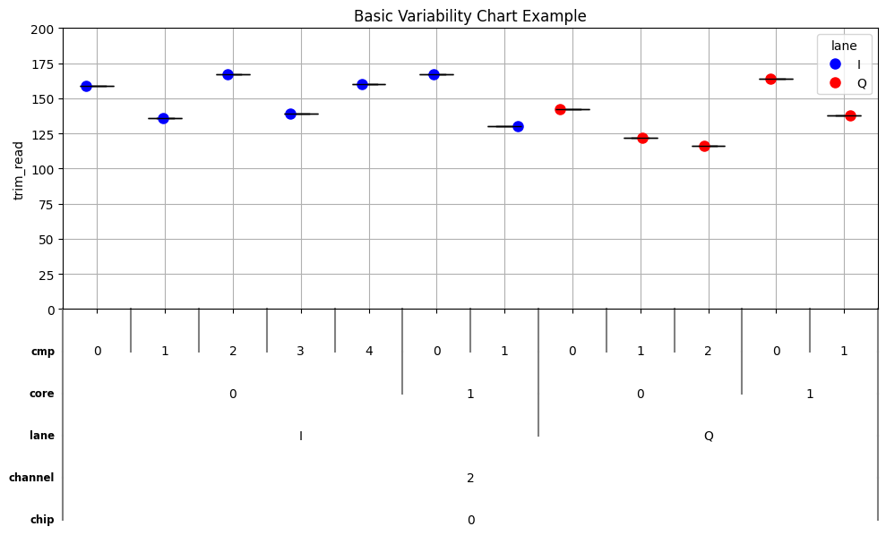

**Features:** 5-level hierarchical grouping, cell means, basic styling

**See:** `examples/basic_example.py` for complete code

---

### Advanced Example: Demonstrates advanced features including custom spacing, jittering, and color themes.
```python
# Full sample data from main_example
str_data = ('chip, channel, lane, core, cmp, trim_read\n'
            '0   , 2      , I   , 0   , 0  , 159\n'
            '0   , 2      , I   , 0   , 1  , 136\n'
            '0   , 2      , I   , 0   , 2  , 167\n'
            '0   , 2      , I   , 0   , 3  , 139\n'
            '0   , 2      , I   , 0   , 4  , 160\n'
            '0   , 2      , I   , 0   , 5  , 152\n'
            '0   , 2      , I   , 1   , 0  , 167\n'
            '0   , 2      , I   , 1   , 1  , 130\n'
            '0   , 2      , I   , 1   , 2  , 143\n'
            '0   , 2      , I   , 1   , 3  , 158\n'
            '0   , 2      , I   , 1   , 4  , 142\n'
            '0   , 2      , I   , 1   , 5  , 56\n'
            '0   , 2      , Q   , 0   , 0  , 142\n'
            '0   , 2      , Q   , 0   , 1  , 122\n'
            '0   , 2      , Q   , 0   , 2  , 116\n'
            '0   , 2      , Q   , 0   , 3  , 135\n'
            '0   , 2      , Q   , 0   , 4  , 96\n'
            '0   , 2      , Q   , 0   , 5  , 130\n'
            '0   , 2      , Q   , 1   , 0  , 164\n'
            '0   , 2      , Q   , 1   , 1  , 138\n'
            '0   , 2      , Q   , 1   , 2  , 168\n'
            '0   , 2      , Q   , 1   , 3  , 148\n'
            '0   , 2      , Q   , 1   , 4  , 60\n'
            '0   , 2      , Q   , 1   , 5  , 135'.replace(' ', ''))
pd_data = pd.read_csv(StringIO(str_data))

# Create advanced chart with all features
pvc = PyVarChart(
    # Custom label spacing per level
    label_spacing=[0.10, 0.08, 0.06, 0.05, 0.04],

    # Data configuration
    str_yaxis_var_name='trim_read',
    lst_xaxis_var_names=['chip', 'channel', 'lane', 'core', 'cmp'],
    str_legend='lane',

    # Visual styling
    int_jitter_points=1,
    int_marker_size=7,
    str_marker_theme='Default',
    str_color_theme='Blue to Green to Red',

    # Layout
    str_title='trim_read distribution Across Configs - Advanced Example',
    int_frame_size_x=10,
    int_frame_size_y=6,

    # Custom ordering (reversed)
    dict_xaxis_orderings={'cmp': [5, 4, 3, 2, 1, 0]},

    # Label control
    lst_rotation=['Horizontal', 'Horizontal', 'Vertical', 'Vertical', 'Horizontal'],
    lst_xaxis_font_size=[11, 10, 9, 8, 9],
)

# Generate chart
pvc.analyze(pd_data)
fig, ax = pvc.plot(1)
plt.title(f'Advanced Example\n'
          f'str_legend={pvc.str_legend}, str_yaxis_var_name={pvc.str_yaxis_var_name}, '
          f'int_jitter_points={pvc.int_jitter_points}, int_boxplots={pvc.int_boxplots}, int_show_points={pvc.int_show_points}\n'
          f'str_color_theme={pvc.str_color_theme}, int_continuous_scale={pvc.int_continuous_scale}, '
          f'int_reverse_color_scheme={pvc.int_reverse_color_scheme}, \n'
          f'int_show_cell_means={pvc.int_show_cell_means}, '
          f'lst_show_group_means={pvc.lst_show_group_means}, int_show_grand_mean={pvc.int_show_grand_mean}')
ax.set_ylim(0, 255)
plt.tight_layout()
```

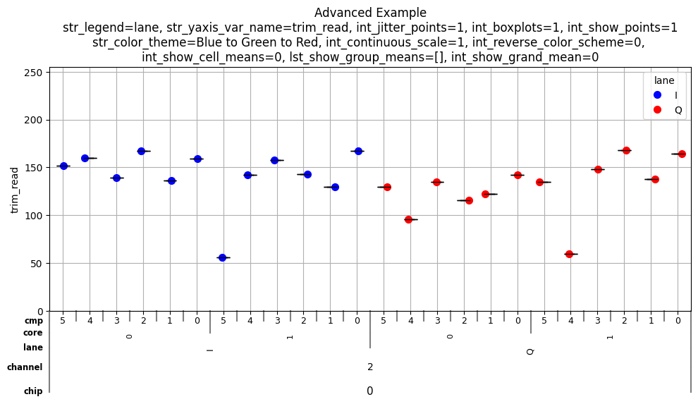

**Features:** Custom label spacing, point jittering, custom ordering, viridis colormap, 5 grouping levels

**See:** `examples/advanced_example.py` for complete code

---

### Complex Example: Full-featured RF testing analysis with 6 levels of hierarchical grouping.
```python
# data available in examples/complex_example.py
pd_data = pd.read_csv(StringIO(str_data))
pvc = PyVarChart(
    label_spacing=[0.025, 0.06, 0.07, 0.28, 0.02, 0.025], # note the larger 4th level spacing for vertical label
    str_yaxis_var_name='nf_db',
    lst_xaxis_var_names=['pin_dbm', 'tx0_pga_gain', 'freq', 'trx_and_sx', 'standard_and_band', 'offset_mhz'],
    str_legend='temp',
    int_jitter_points=1,
    int_boxplots=1,
    int_show_points=1,
    int_marker_size=8,
    str_marker_theme='Default',
    str_color_theme='blue_to_green_to_red',
    str_title='Sample RF PyVarChart',
    int_continuous_scale=0,
    int_reverse_color_scheme=0,
    int_show_cell_means=1,
    lst_show_group_means=['tx0_pga_gain'],
    int_show_grand_mean=1,
    int_frame_size_x=17,
    int_frame_size_y=10,
    dict_xaxis_orderings={'freq': np.sort(pd_data['freq'].unique()).tolist()},
    lst_rotation=['Horizontal', 'Horizontal', 'Horizontal', 'Horizontal', 'Vertical', 'Horizontal'],
    lst_xaxis_font_size=[10, 10, 10, 10, 10, 10],
)
# Generate chart
pvc.analyze(pd_data)
fig, ax = pvc.plot(1)
plt.title(f'Sample RF PyVarChart - Complex Example\n'
          f'str_legend={pvc.str_legend}, str_yaxis_var_name={pvc.str_yaxis_var_name}, '
          f'int_jitter_points={pvc.int_jitter_points}, int_boxplots={pvc.int_boxplots}, int_show_points={pvc.int_show_points}, '
          f'str_color_theme={pvc.str_color_theme}, int_continuous_scale={pvc.int_continuous_scale},\n'
          f'int_reverse_color_scheme={pvc.int_reverse_color_scheme}, int_show_cell_means={pvc.int_show_cell_means}, '
          f'lst_show_group_means={pvc.lst_show_group_means}, int_show_grand_mean={pvc.int_show_grand_mean}')
plt.tight_layout()
```
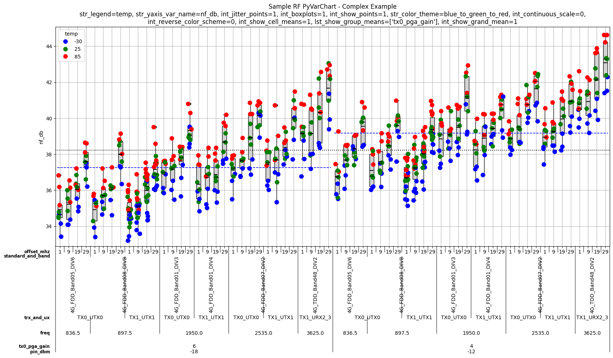

**Features:** 6-level hierarchical grouping, vertical label rotation, custom ordering, continuous scale legend, comprehensive statistical overlays

**See:** `examples/complex_example.py` for complete code

---

### Continuous Scale Feature

PyVarChart's continuous scale feature automatically simplifies legends when dealing with many continuous numeric values. Instead of showing every unique value (which creates cluttered legends), it intelligently selects 5-6 representative values and uses smooth color gradient interpolation.

#### When to Use Continuous Scale

- **Enable (`int_continuous_scale=1`)** when you have many (>10) numeric legend values
- **Disable (`int_continuous_scale=0`)** for discrete categories or when you need to see all values
- **Auto-detection:** Automatically reverts to categorical mode if any string values are detected

#### Comparison: Categorical vs Continuous

**Without Continuous Scale (Categorical Mode):**

Shows ALL unique values - can create very cluttered legends when you have many data points.
```python
pvc1 = PyVarChart(
    str_yaxis_var_name='measurement',
    lst_xaxis_var_names=['location', 'operator'],
    str_legend='temperature',
    str_color_theme='viridis',
    int_continuous_scale=0,  # Disabled - treats as categorical
    str_title='Categorical Mode: All Values Shown',
    int_frame_size_x=8,
    int_frame_size_y=6,
    int_marker_size=8,
)

# Generate chart
pvc1.analyze(pd_data)
fig1, ax1 = pvc1.plot(1)
```
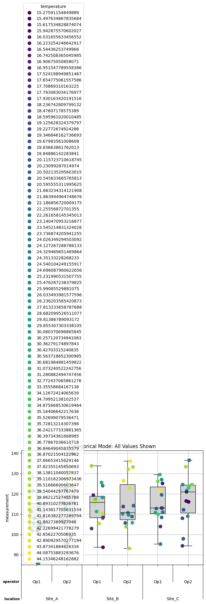

**With Continuous Scale (Enabled):**

Auto-selects 5-6 representative values using percentiles (0%, 20%, 40%, 60%, 80%, 100%). Much cleaner!
```python
pvc2 = PyVarChart(
    str_yaxis_var_name='measurement',
    lst_xaxis_var_names=['location', 'operator'],
    str_legend='temperature',
    str_color_theme='viridis',
    int_continuous_scale=1,  # Auto-select 5-6 representative values
    str_title='Continuous Mode: 5-6 Representative Values',
    int_frame_size_x=8,
    int_frame_size_y=6,
    int_marker_size=8,
)

pvc2.analyze(pd_data)
fig2, ax2 = pvc2.plot(2)
```
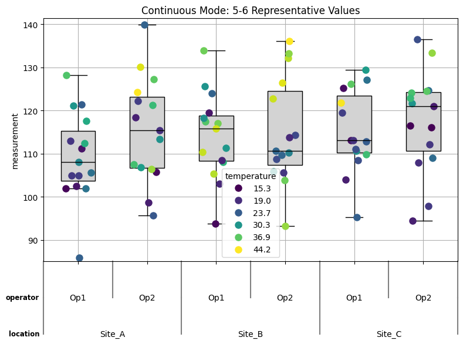

#### How It Works

```python
pvc = PyVarChart(
    str_yaxis_var_name='measurement',
    lst_xaxis_var_names=['location', 'operator'],
    str_legend='temperature',  # Continuous numeric values
    int_continuous_scale=1,    # Enable continuous scale
    str_color_theme='viridis',
    int_frame_size_x=10,
    int_frame_size_y=8
)

pvc.analyze(df)
fig, ax = pvc.plot(1)
```

**Benefits:**
- Cleaner, more readable legends
- Smooth color gradients across the data range
- Representative values include min, max, and key percentiles
- Automatic mode detection (reverts to categorical for strings)

#### Colormap Examples with Continuous Scale

**Plasma (Sequential):**
```python
pvc3 = PyVarChart(
    str_yaxis_var_name='measurement',
    lst_xaxis_var_names=['location', 'operator'],
    str_legend='temperature',
    str_color_theme='plasma',
    int_continuous_scale=1,
    str_title='Continuous Scale: Plasma Colormap',
    int_frame_size_x=8,
    int_frame_size_y=6,
    int_marker_size=8,
)

pvc3.analyze(pd_data)
fig3, ax3 = pvc3.plot(3)
```
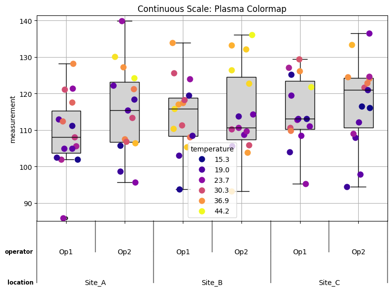

**Coolwarm (Diverging - Blue=Cold, Red=Hot):**
```python
pvc4 = PyVarChart(
    str_yaxis_var_name='measurement',
    lst_xaxis_var_names=['location', 'operator'],
    str_legend='temperature',
    str_color_theme='coolwarm',  # Blue=cold, Red=hot
    int_continuous_scale=1,
    str_title='Temperature Analysis (coolwarm)',
    int_frame_size_x=8,
    int_frame_size_y=6,
    int_marker_size=10,
)

pvc4.analyze(pd_data)
fig4, ax4 = pvc4.plot(4)
```
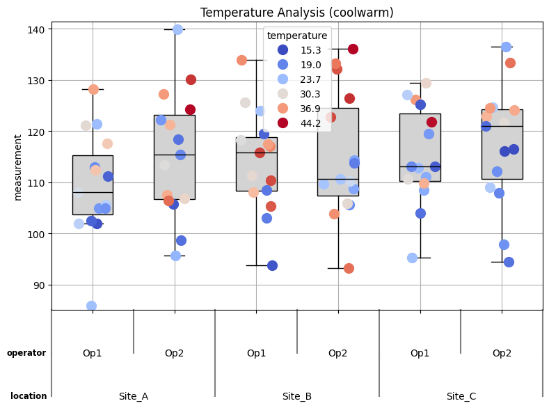

#### Auto-Revert Behavior

When `int_continuous_scale=1` is set but string values are detected, the system automatically reverts to categorical mode:
```python
pvc5 = PyVarChart(
    str_yaxis_var_name='measurement',
    lst_xaxis_var_names=['location', 'operator'],
    str_legend='operator',
    str_color_theme='Set1',
    int_continuous_scale=1,  # Requesting continuous, but will auto-revert
    str_title='Auto-Reverts to Categorical (strings detected)',
    int_frame_size_x=8,
    int_frame_size_y=6,
    int_marker_size=10,
)

pvc5.analyze(pd_data)
fig5, ax5 = pvc5.plot(5)
```
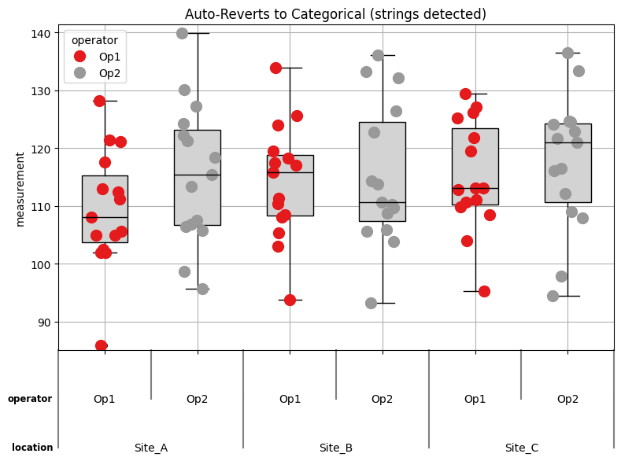

**See:** `examples/continuous_scale_demo.py` for complete demonstration code

---

### Colormap Showcase

PyVarChart supports all matplotlib colormaps (100+ options) plus custom gradients. Choose the right colormap for your data type:

- **Qualitative:** For categorical data with no ordering (tab10, Set1, Dark2, Pastel1)
- **Sequential:** For ordered data from low to high (viridis, plasma, Blues, Greens)
- **Diverging:** For data with a meaningful midpoint (RdYlBu, coolwarm, seismic)

#### Custom Gradient

The default `'blue_to_green_to_red'` provides an intuitive low→medium→high visualization:
```python
pvc.str_color_theme='blue_to_green_to_red'
plt.plot(1)
```
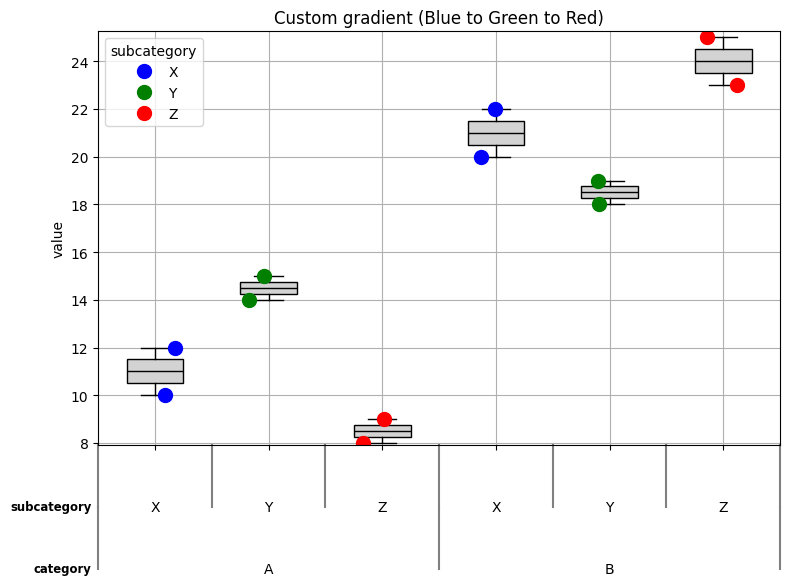

#### Qualitative Colormaps

Perfect for categorical data where categories have no inherent order:

**Tableau 10 (tab10):**
```python
pvc.str_color_theme='tab10'
plt.plot(1)
```
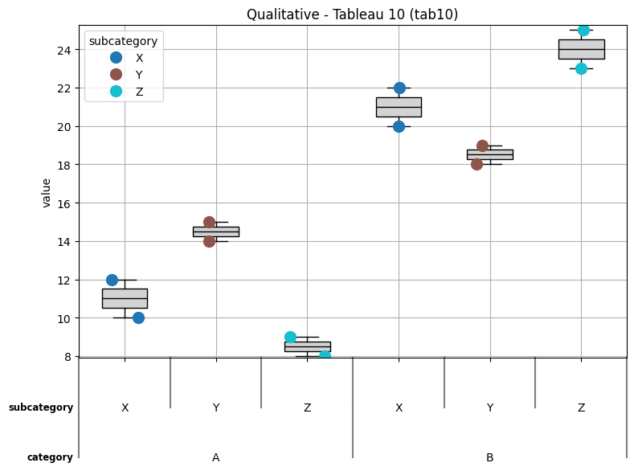

**ColorBrewer Set1:**
```python
pvc.str_color_theme='Set1'
plt.plot(1)
```
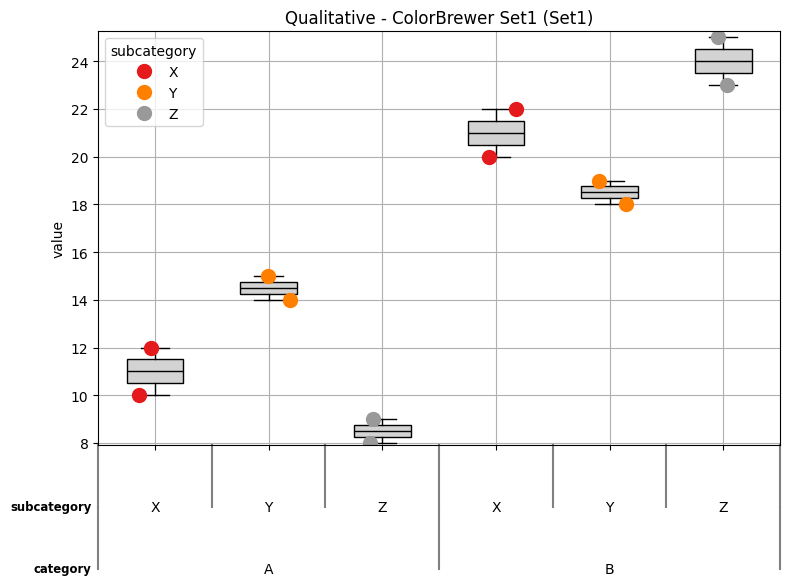

**Dark2 (High Contrast):**
```python
pvc.str_color_theme='Dark2'
plt.plot(1)
```
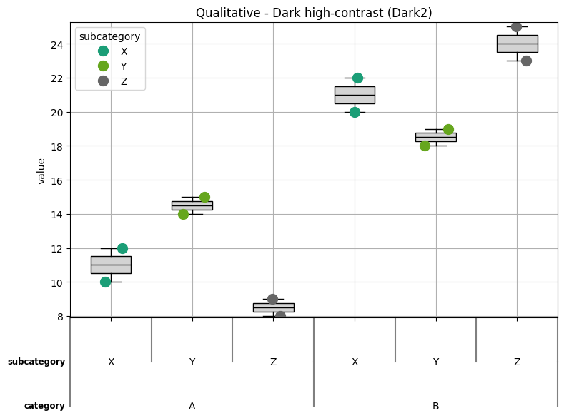

**Pastel1 (Soft Colors):**
```python
pvc.str_color_theme='Pastel1'
plt.plot(1)
```
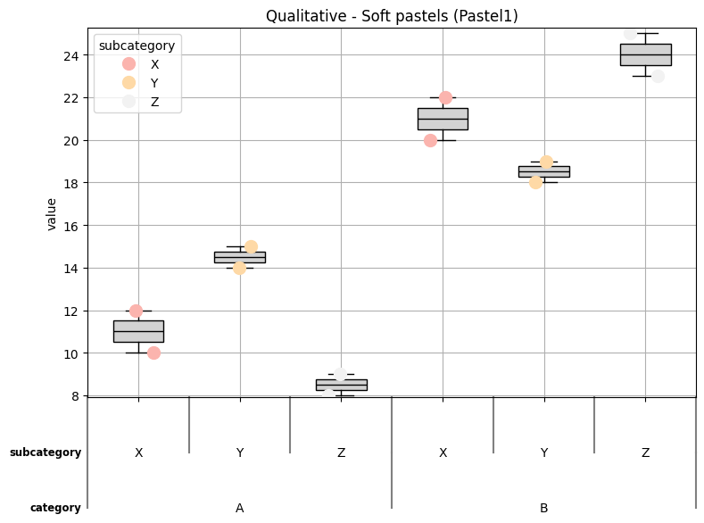

#### Sequential Colormaps

Ideal for ordered/continuous data. These are perceptually uniform and colorblind-friendly:

**Viridis:**
```python
pvc.str_color_theme='Viridis'
plt.plot(1)
```
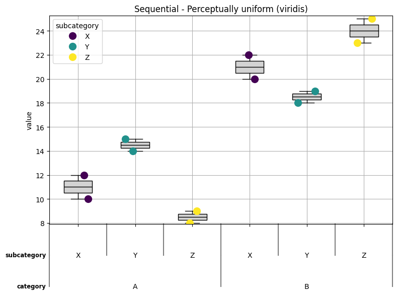

**Plasma:**
```python
pvc.str_color_theme='Plasma'
plt.plot(1)
```
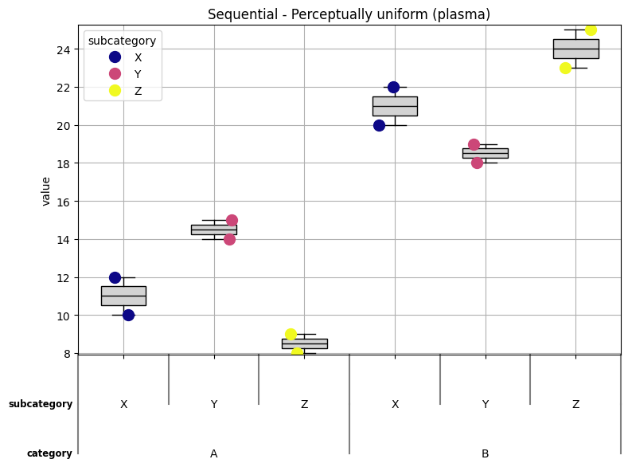

#### Diverging Colormaps

Best when data has a meaningful center point (e.g., temperature, correlation):

**Red-Yellow-Blue (RdYlBu):**
```python
pvc.str_color_theme='RdYlBu'
plt.plot(1)
```
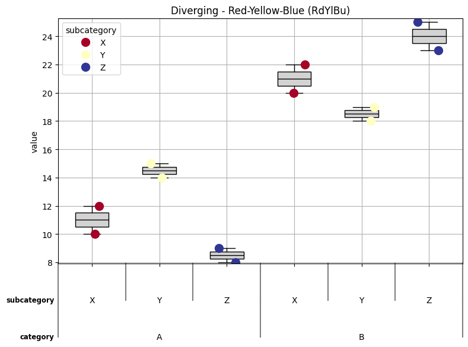

**Coolwarm:**
```python
pvc.str_color_theme='Coolwarm'
plt.plot(1)
```
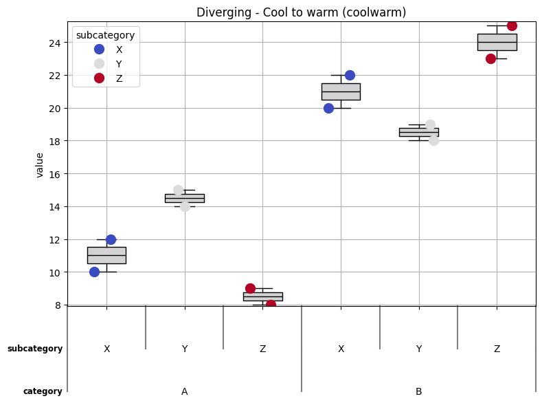

#### Reversing Colormaps

Two ways to reverse any colormap:

**Method 1: Add `_r` suffix**
```python
pvc.str_color_theme='tab10_r'  # Reversed tab10
plt.plot(1)
```

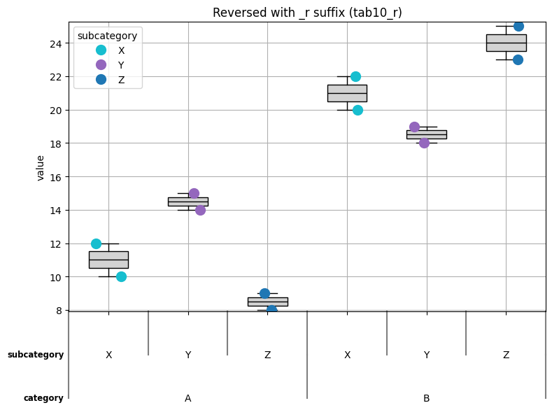

**Method 2: Use parameter**
```python
pvc.str_color_theme='viridis',
pvc.int_reverse_color_scheme=1  # Reverse the colormap
plt.plot(1)
```

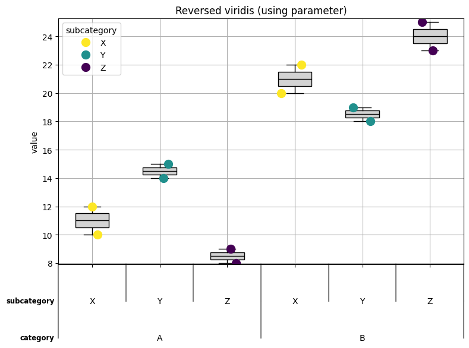

#### Usage

```python
pvc = PyVarChart(
    str_yaxis_var_name='measurement',
    lst_xaxis_var_names=['category', 'subcategory'],
    str_legend='group',
    str_color_theme='plasma',        # Any matplotlib colormap name
    int_reverse_color_scheme=0,      # 0=normal, 1=reversed
    int_frame_size_x=8,
    int_frame_size_y=6
)
```

**Available Colormaps:**
- **Qualitative:** tab10, tab20, Set1, Set2, Set3, Pastel1, Pastel2, Dark2, Accent, Paired
- **Sequential:** viridis, plasma, inferno, magma, cividis, Blues, Greens, Reds, Purples, Oranges, YlOrRd, YlOrBr, YlGn, YlGnBu, BuGn, BuPu, GnBu, PuBu, PuBuGn, PuRd, RdPu, OrRd
- **Diverging:** RdYlBu, RdYlGn, RdBu, RdGy, PiYG, PRGn, PuOr, BrBG, coolwarm, seismic, bwr
- **Custom:** blue_to_green_to_red (PyVarChart default)

**See:** `examples/colormap_showcase.py` for complete colormap gallery generation code

---

## API Reference

### PyVarChart Class

#### Constructor Parameters

| Parameter | Type | Default | Description |
|-----------|------|---------|-------------|
| `label_spacing` | `float` or `List[float]` | `0.15` | Vertical spacing between x-axis label levels |
| `str_yaxis_var_name` | `str` | `'y_variable'` | Column name for Y-axis values |
| `lst_xaxis_var_names` | `List[str]` | `None` | List of columns for hierarchical x-axis grouping |
| `str_legend` | `str` | `None` | Column name for legend/color differentiation |
| `int_jitter_points` | `int` | `1` | Enable (1) or disable (0) point jittering |
| `int_boxplots` | `int` | `1` | Show (1) or hide (0) boxplots |
| `int_show_points` | `int` | `1` | Show (1) or hide (0) individual data points |
| `int_marker_size` | `int` | `8` | Size of data point markers |
| `str_marker_theme` | `str` | `'Default'` | Marker style: `'Default'` (circles) or `'Solid'` (varied shapes) |
| `str_color_theme` | `str` | `'blue_to_green_to_red'` | Color palette name (matplotlib colormap or custom) |
| `int_continuous_scale` | `int` | `0` | Enable (1) continuous scale legend quantization |
| `int_reverse_color_scheme` | `int` | `0` | Reverse (1) the color direction |
| `int_show_cell_means` | `int` | `0` | Show (1) cell mean lines |
| `lst_show_group_means` | `List[str]` | `None` | List of grouping variables to show means for |
| `int_show_grand_mean` | `int` | `0` | Show (1) grand mean line |
| `int_frame_size_x` | `int` | `20` | Figure width in inches |
| `int_frame_size_y` | `int` | `6` | Figure height in inches |
| `str_title` | `str` | `None` | Chart title |
| `dict_xaxis_orderings` | `Dict[str, List]` | `None` | Custom sort orders for x-axis categories |
| `lst_rotation` | `List[str]` | `None` | Label rotation per level: `'Horizontal'` or `'Vertical'` |
| `lst_xaxis_font_size` | `List[int]` | `None` | Font size per x-axis level |

#### Methods

**`analyze(pd_data: pd.DataFrame) -> pd.DataFrame`**

Validates data, processes groupings, and prepares internal data structures for plotting.

- **Args:** `pd_data` - DataFrame containing all required columns
- **Returns:** Processed DataFrame (also stored in `self.pd_data_processed`)
- **Must be called before `plot()`**
- **Must be re-run if these parameters change:** `str_yaxis_var_name`, `lst_xaxis_var_names`, `str_legend`, `str_marker_theme`, `int_continuous_scale`, `dict_xaxis_orderings`

**`plot(int_fig_num: int) -> Tuple[plt.Figure, plt.Axes]`**

Creates the matplotlib figure and axes with all configured visualizations.

- **Args:** `int_fig_num` - Matplotlib figure number (useful for managing multiple figures)
- **Returns:** Tuple of `(figure, axes)` objects for further customization
- **Must call `analyze()` first**

- **Can re-`plot()` without calling `analyze()` for the following:** `label_spacing`, `int_jitter_points`, `int_boxplots`, `int_show_points`, `int_marker_size`, `str_color_theme`, `int_reverse_color_scheme`, `int_show_cell_means`, `int_show_grand_mean`, `int_frame_size_x`, `int_frame_size_y`, `str_title`, `lst_rotation`, `lst_xaxis_font_size`


---

## Contributing

Contributions are welcome! Please see [CONTRIBUTING.md](CONTRIBUTING.md) for guidelines.

### Development Setup
```bash
git clone https://github.com/Guy-Steiff/pyvarchart.git
cd pyvarchart
pip install -e ".[dev]"
pytest tests/
```

---

## License

This project is licensed under the MIT License - see the [LICENSE](LICENSE) file for details.

---

## Changelog

See [CHANGELOG.md](CHANGELOG.md) for version history and release notes.

---

## Acknowledgments

- Built on [matplotlib](https://matplotlib.org/), [pandas](https://pandas.pydata.org/), and [numpy](https://numpy.org/)

---

## Contact

- **Repository:** https://github.com/Guy-Steiff/pyvarchart
- **Issues:** https://github.com/Guy-Steiff/pyvarchart/issues
- **Email:** guy.steiff-pvc@bytz.me
- **About the author**: https://guysteiff.vercel.app/
- **LinkedIn:** https://linkedin.com/in/guy-steiff-7bbabba6
- **Rumble:** https://rumble.com/c/c-7834440?e9s=src_v1_cbl

## Support

- **Bitcoin:** bc1qvyf20gjnm7rck35tnsm48cq8f82tttxkgmgkll
- **Buy me a coffee:** https://buymeacoffee.com/steiff
---

**Happy charting! 📊**
